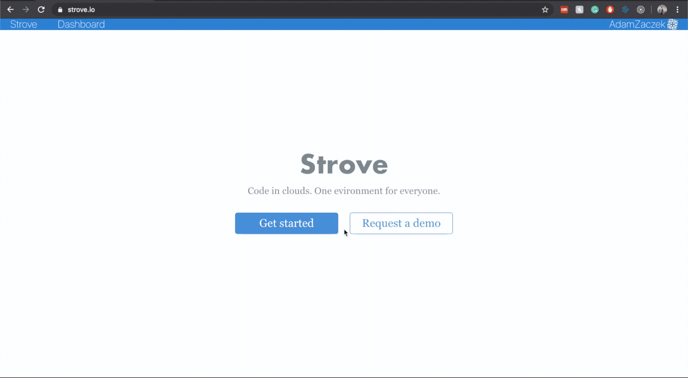

## [Strove.io](https://www.strove.io/) - move programming to the cloud 

Strove brings powerful, ready in seconds, pre-configured cloud
servers to write, run, build, share and
secure software remotely

Obviously, Strove is made with Strove as well

### [Edit source code in Strove](https://strove.io/#https://github.com/stroveio/strove.io-client)

or, visit our website

### [https://www.strove.io/](https://www.strove.io/)

## Get started

Add # + github url after strove.io to get start coding right away, for example: https://strove.io/#https://github.com/stroveio/2048-clone

## Docs

### If you're here just to find docs we've got you covered

[Docs link](https://docs.strove.io/embedding-strove)

## Why did we make this?

There are several problems programmers face make this project important in our eyes.

1. Security
   It’s safer to store code in the cloud as it reduces the vector of physical attacks and chance of stealing the source. If the machine gets stolen, all the company has to do is deny the access from the stolen device.
2. 'It works on my machine' problem. All team members access instances of the same programming environment, no matter if they use Macbook or an old PC.
3. It is hard to use different computers when working on a project. The code lives in a cloud. This makes it possible to resume working on a project from any computer with internet access. This is especially useful for students and people who travel a lot.
4. Programmers waste a lot of time on setting up the environment. The browser-based solution can cut the time to set a programming environment to seconds.

## Embedding

Similarly to Youtube, Strove can be used in any site. Live demo using fullstack hackathon stater:

### [Example embeded strove project](https://priceless-raman-a750f4.netlify.com/hackathon-starter-strove/)

More on how to use use Strove in [this docs link](https://docs.strove.io/embedding-strove)

## Found a bug?

Raise an issue! We'll take a look!

## Contribute!

Here are our contributors so far:

<table>
<tr align="center">
<td align="center"><a href="https://github.com/AdamZaczek"> <b>Adam Żaczek</b></a></td>
<td align="center"><a href="https://github.com/jaroszpiotr91"> <b>Piotr Jarosz</b></a></td>
<td align="center"><a href="https://github.com/MateuszOlek"> <b>Mateusz Olek</b></a></td>
<td align="center"><a href="https://github.com/AceSpadeAble"> <b>Pawel Wygoda</b></a></td>
<td align="center"><a href="https://github.com/DawidUrbanek"> <b>Dawid Urbanek</b></a></td>
</tr>
</table>

## Supported languages

Strove supports all major Linux-supported languages including: Python, TypeScript, Go, Javascript, PHP, C, C#, Java, Ruby, C++, and many more.

<table>
<tr align="center">
<td align="center"></td>
<td align="center"></td>
<td align="center"></td>
<td align="center"></td>
<td align="center"></td>
<td align="center"></td>
<td align="center"></td>
<td align="center"></td>
<td align="center"></td>

</tr>
</table>

