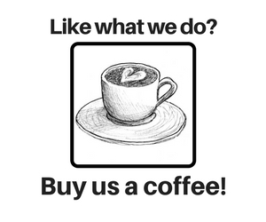

# [SiliSky](https://www.silisky.com/)

Say goodbye to 'it works on my machine' problem by coding in the same environment no matter the machine. All you need is a browser!

# Get started
Add # + github url after silisky.com/ to get start coding right away, for example: silisky.com/#https://github.com/rt2zz/redux-persist
# Knwon issues

# Contributors

<table>
<tr>
<td align="center"><a href="https://github.com/Urban35"> <b>Dawid Urbanek</b></a></td>
<td align="center"><a href="https://github.com/jaroszpiotr91"> <b>Piotr Jarosz</b></a></td>
<td align="center"><a href="https://github.com/MateuszOlek"> <b>Mateusz Olek</b></a></td>
<td align="center"><a href="https://github.com/AceSpadeAble"> <b>Pawel Wygoda</b></a></td>
</tr>
</table>

# Donations

 

